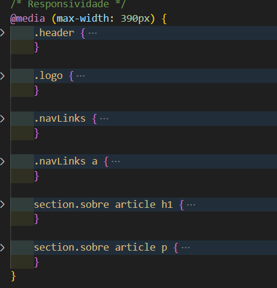

# MarketFacilNext
# Componentes
## Header
### JS

O código em JS constrói o componente de Header a ser utilizado entre os itens e páginas relacionados à Home do Site. O Header redireciona para as páginas de Sobre, Pedidos e Cadastro (LogOut). O elemento da Logo redireciona para a Home.

### CSS

O código CSS estiliza os elementos do Header, garantindo também a responsividade em uma tela menor.